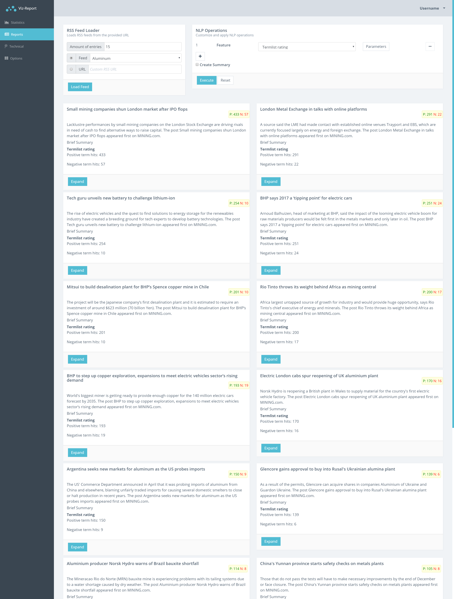

# Viz-Report

Viz-Report is a prototype of a commodity market analysis tool which makes use of various visualization techniques (including charts and textvis), as well as NLP.



## Implementation
### Libraries and Frameworks
#### WebClient
* Angular 4.4.6
* Bootstrap 4.0
* modularcode/moduler-admin-html 1.3.0 template
* d3 4.12.2
* compromise 11.2.3
* compendium-js 0.0.28
* snowball 0.3.1
* TypeScript 2.4
#### Server
* NodeJS 8.9
* express 4.15
* express-ws 3.0
* excel 0.1.7
* lda 0.1.9
* multer 1.3.0
* stopword 0.1.8
* text-miner 1.0.5


### Build
For building the application, you need to have [NodeJS](https://nodejs.org/en/) 8.9.x with npm 5.5.x (or compatible).

After [downloading](#download) run the following commands from within the folders "server" and "webclient" each:


Installing npm dependencies 
```
npm install
```
Note: On Windows "windows-build-tools" is required for the server build (i.e. Python 2 and Visual Studio dependencies)

Build the project and start local web server
```
npm start
```

Open the project [http://localhost:4200](http://localhost:4200).

> The project is built using angular-cli and webpack.


Launch auth server [http://localhost:8081](http://localhost:8081).

> The project is built by npm and NodeJS.

<br>
## Folder Structure

```
├── server/                   # server source files        
├── webclient/                # client implementation        
├── */node_modules/           # node dependencies        
├── webclient/dist/           # compiled angular build of the webclient
├── webclient/src/            # client source files
└── */package.json            # npm configuration files
```
